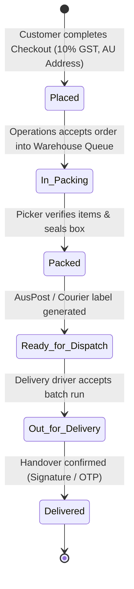
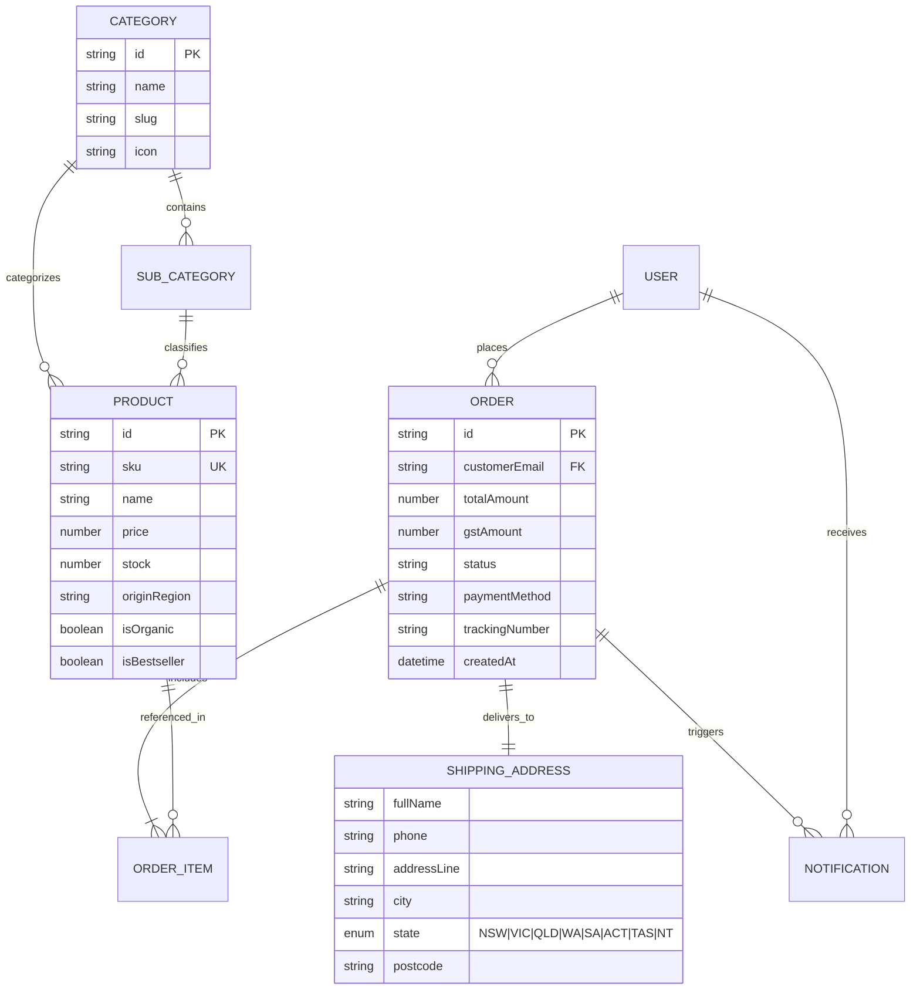

# 🛒 Indian Store Australia 🇦🇺

[](https://github.com/ashirraju/indian-store/actions/workflows/deploy.yml)
[](https://angular.dev/)
[](https://www.keycloak.org/)
[]()

An enterprise-grade, high-performance E-Commerce and Supply Chain ERP platform designed for authentic Indian groceries, GI-tagged regional delicacies, pure ghee, and spices across Australia. Built with **Angular 22 (Standalone + Signals)** and secured via **Keycloak OpenID Connect (OIDC)** with end-to-end Role-Based Access Control (RBAC).

---

## 🌐 Live Deployments & Endpoints

| Environment | Service | URL |
| :--- | :--- | :--- |
| **Production Storefront** | GitHub Pages | [https://ashirraju.github.io/indian-store/](https://ashirraju.github.io/indian-store/) |
| **Vercel Mirror** | Vercel Deployment | [https://indian-store.vercel.app](https://indian-store.vercel.app) *(Configured via `vercel.json`)* |
| **Backend REST API** | Express / Node API | [https://indian-store-api.trader-news.co.in/api/v1](https://indian-store-api.trader-news.co.in/api/v1) |
| **API Health Check** | Service Health | [https://indian-store-api.trader-news.co.in/api/health](https://indian-store-api.trader-news.co.in/api/health) |
| **OpenAPI / Swagger Docs** | Interactive API Specs | [https://indian-store-api.trader-news.co.in/api-docs/json](https://indian-store-api.trader-news.co.in/api-docs/json) |
| **IAM / Keycloak SSO** | Keycloak Auth Server | [https://indian-store-auth.trader-news.co.in](https://indian-store-auth.trader-news.co.in) |

---

## 🔐 Keycloak IAM Configuration

| Parameter | Development | Production |
| :--- | :--- | :--- |
| **Keycloak URL** | `http://localhost:8080` | `https://indian-store-auth.trader-news.co.in` |
| **Realm** | `indian-store` | `indian-store` |
| **Staff Client ID** | `indian-store-public` | `indian-store-public` |
| **Customer Client ID**| `indian-store-customer`| `indian-store-customer` |
| **Auth Protocol** | OpenID Connect (PKCE S256) | OpenID Connect (PKCE S256) |

---

## 👥 Role-Based Access Control (RBAC) & Portals

The application implements granular role-based authentication with direct Keycloak SSO redirects and route guards (`roleAuthGuard`).

```
                              ┌───────────────────────────────────┐
                              │  Keycloak SSO / Role Auth Guard   │
                              └─────────────────┬─────────────────┘
                                                │
         ┌───────────────────┬──────────────────┼───────────────────┬───────────────────┐
         ▼                   ▼                  ▼                   ▼                   ▼
   ┌───────────┐       ┌───────────┐      ┌───────────┐       ┌───────────┐       ┌───────────┐
   │ Customer  │       │  Manager  │      │Operations │       │ Delivery  │       │   Admin   │
   │  (/store) │       │ (/manager)│      │(/operatns)│       │(/delivery)│       │  (/admin) │
   └───────────┘       └───────────┘      └───────────┘       └───────────┘       └───────────┘
```

| Role | Route | Permissions & Responsibilities |
| :--- | :--- | :--- |
| **Customer** | `/store` | • Public storefront access<br>• Browse products with dietary & regional origin filters (GI tags)<br>• Manage Cart Drawer & Wishlist Drawer<br>• Checkout with Australian addresses (NSW, VIC, QLD, WA, SA, ACT, TAS, NT)<br>• Live order step-tracking & SSE realtime notifications |
| **Manager** | `/manager` | • Store catalog management (Add/Edit products, AUD pricing, GI origin)<br>• Inventory monitor & low-stock alerts with reorder triggers<br>• Sales revenue analytics, AOV (Average Order Value), and order metrics |
| **Operations** | `/operations` | • Warehouse fulfillment & packing queue<br>• Item picker checklist & packaging validation<br>• Order stage updates (`Placed` ➔ `In Packing` ➔ `Packed` ➔ `Ready for Dispatch`)<br>• Generate AusPost / courier shipping manifests |
| **Delivery** | `/delivery` | • Driver dispatch & logistics routing (Sydney & Melbourne Metro Hubs)<br>• Transit updates (`Ready for Dispatch` ➔ `Out for Delivery` ➔ `Delivered`)<br>• Electronic Proof of Delivery (OTP, Signature, Safe Drop Photo) |
| **Admin** | `/admin` | • Super-administrator control center<br>• Keycloak realm user management & role mapping<br>• CMS festival banners (Diwali, Holi, Pongal) & discount coupon management<br>• System audit trail & activity logs |

---

## 🔄 Order Lifecycle & Pipeline Flow



---

## 🗄️ Entity Relations & Data Models



---

## 📡 REST API Documentation

Base URL: `https://indian-store-api.trader-news.co.in/api/v1`

### 1. Categories & Subcategories
- `GET /categories` - Retrieve category tree with product counts.
- `GET /categories/:id` - Get category details by ID or slug.
- `POST /categories` - Create new top-level category *(Staff/Admin)*.
- `PUT /categories/:id` - Update category details *(Staff/Admin)*.
- `DELETE /categories/:id?force=true` - Remove category *(Admin)*.
- `GET /categories/:id/sub-categories` - List child subcategories.
- `POST /categories/:id/sub-categories` - Add subcategory under category.
- `PUT /categories/sub-categories/:id` - Update subcategory name/slug.
- `DELETE /categories/sub-categories/:id` - Delete subcategory.

### 2. Product Catalog & Inventory
- `GET /products` - Filtered & paginated product catalog.
  - Query params: `category`, `subCategory`, `search`, `stockStatus` (`in_stock` | `low_stock` | `out_of_stock`), `organic`, `bestseller`, `sort`, `page`, `limit`.
- `GET /products/:id` - Product details by ID or SKU.
- `POST /products` - Create new product *(Staff/Admin)*.
- `PUT /products/:id` - Full product update *(Staff/Admin)*.
- `DELETE /products/:id` - Remove product *(Admin)*.
- `PATCH /products/:id/discount` - Update promo discount percentages or flat discounts.
- `PATCH /products/:id/stock` - Adjust stock quantities with audit reason.
- `PATCH /products/:id/toggle` - Toggle `isBestseller` or `isOrganic` badges.
- `POST /products/bulk/delete` - Bulk delete products by ID list.
- `POST /products/bulk/import` - Bulk CSV / JSON import with validation summary.
- `GET /products/admin/summary` - Metrics summary for admin dashboard.

### 3. Orders & Checkout
- `POST /orders/checkout` - Create customer order with line items, Australian shipping address, coupon, and payment method.
- `GET /orders` - Query orders filtered by `status`, `customerEmail`, `page`, `limit`, `sort`.
- `GET /orders/:id` - Complete order detail with tracking events and address.
- `PATCH /orders/:id/status` - Transition status (`In Packing`, `Packed`, `Ready for Dispatch`, `Out for Delivery`, `Delivered`).
- `POST /orders/:id/cancel` - Cancel order with customer/staff reason.
- `PATCH /orders/:id/payment` - Update payment transaction status (`PAID`, `PENDING`, `REFUNDED`).

### 4. Inventory, Coupons & Analytics
- `POST /coupons/validate` - Validate discount code against subtotal and user profile.
- `GET /inventory?lowStockOnly=true` - Stock health inspection for operations.
- `GET /reports/sales-revenue` - Revenue metrics, average order value, and top categories.

### 5. Real-Time Notifications & SSE
- `GET /notifications` - List user notifications with unread count.
- `GET /notifications/unread-count` - Fast polling unread badge counter.
- `PATCH /notifications/:id/read` - Mark single notification as read.
- `PATCH /notifications/mark-all-read` - Mark all notifications as read.
- `GET /notifications/stream?role=:role` - **Server-Sent Events (SSE)** continuous push stream for live order updates.

---

## 🇦🇺 Australian Business & Operations Specs

- **ABN**: `48 612 390 124`
- **Taxes**: 10% Australian GST automatically calculated at checkout.
- **Free Shipping**: Free Express shipping on orders over **$75 AUD**.
- **Supported Payment Gateways**: Credit/Debit Cards, Apple Pay, PayPal, Afterpay, Zip Pay, Cash on Delivery (COD).
- **Physical Distribution Centers**:
  - **Sydney Hub**: `Unit 4, 15-17 Wentworth St, Parramatta NSW 2150`
  - **Melbourne Hub**: `108 Collins Street, Melbourne VIC 3000`

---

## 🛠️ Tech Stack & Architecture

- **Frontend Framework**: Angular 22 (Standalone Components, Signals, Computed Values, `@if` / `@switch` control flow)
- **Security & IAM**: Keycloak JS `^26.2.4`, PKCE OpenID Connect Authentication
- **State Management**: Reactive `StoreStateService` with Angular Signals + LocalStorage persistence
- **Architecture Diagram**: [indian-store-flowchart.drawio](file:///Users/ashirraju/Desktop/indian-store/indian-store-flowchart.drawio) (Native Draw.io XML)
- **Unit Testing**: Vitest `^4.0.8` + jsdom
- **Hosting & CI/CD**: GitHub Pages Actions Workflow (`.github/workflows/deploy.yml`) + Vercel SPA rewrites (`vercel.json`)

---

## 🚀 Getting Started

### Prerequisites
- Node.js >= 20.x
- npm >= 10.x

### Installation
```bash
git clone https://github.com/ashirraju/indian-store.git
cd indian-store
npm install
```

### Local Development
```bash
# Starts development server at http://localhost:4200/
npm start

# Connect to live production backend locally
npm run start:prod
```

### Build & Deploy
```bash
# Production build
npm run build

# Deploy to GitHub Pages
npm run deploy
```

### Running Tests
```bash
# Run unit tests with Vitest
npm test
```

---

## 📄 License & Ownership

© 2026 **Indian Store Australia Pty Ltd**. All rights reserved. Registered in Australia.
